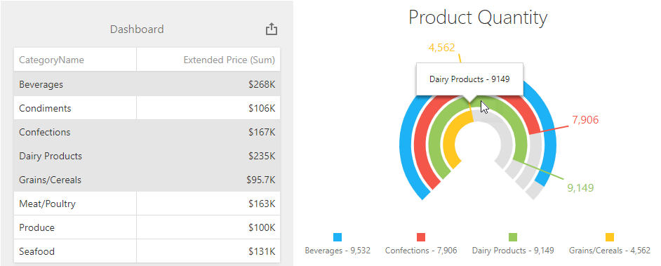
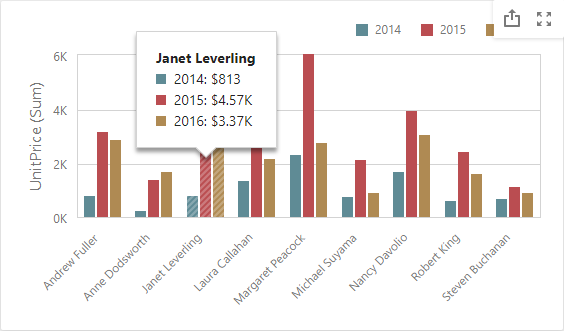

<!-- default badges list -->

<!-- default badges end -->
# Dashboard for ASP.NET Core - How to add custom interactivity to a dashboard

The Web Dashboard allows you to add a custom interactivity to dashboards. For this, handle the [ViewerApiExtensionOptions.onItemVisualInteractivity](https://docs.devexpress.com/Dashboard/js-DevExpress.Dashboard.ViewerApiExtensionOptions?p=netframework#js_devexpress_dashboard_viewerapiextensionoptions_onitemvisualinteractivity) event. You can get data axes used to apply custom interactivity actions, specify the selection mode for dashboard item elements and so on. Use event arguments to process the [multidimensional data](https://docs.devexpress.com/Dashboard/403003/web-dashboard/dashboard-control-for-javascript-applications-jquery-knockout-etc/obtain-underlying-and-displayed-data) to get the slice, axes, or tuples.

After a user changes the selection in the dashboard item, the [ViewerApiExtensionOptions.onItemSelectionChanged](https://docs.devexpress.com/Dashboard/js-DevExpress.Dashboard.ViewerApiExtensionOptions#js_devexpress_dashboard_viewerapiextensionoptions_onitemselectionchanged) event is raised.

This example shows the following interactivity customization:

- Select categories in the [Grid](https://docs.devexpress.com/Dashboard/117161/web-dashboard/create-dashboards-on-the-web/dashboard-item-settings/grid) dashboard item to visualize the total sales in the [dxBarGauge](https://js.devexpress.com/Documentation/ApiReference/UI_Components/dxBarGauge/) widget. Note that the [hidden](https://docs.devexpress.com/Dashboard/117064/web-dashboard/create-dashboards-on-the-web/binding-dashboard-items-to-data/hidden-data-items) 'Quantity' measure is used to pass values to the [client](https://docs.devexpress.com/Dashboard/116302/web-dashboard/aspnet-web-forms-dashboard-control/client-side-api-overview).

  
  
- The [Chart](https://docs.devexpress.com/Dashboard/117159/web-dashboard/create-dashboards-on-the-web/dashboard-item-settings/chart) dashboard item highlights bars corresponding to a hovered argument value.
  
  

## Files to Review

* [CustomInteractivity.js](./CS/AspNetCoreDashboard_CustomInteractivity/wwwroot/js/CustomInteractivity.js)
* [Index.cshtml](./CS/AspNetCoreDashboard_CustomInteractivity/Pages/Index.cshtml) 

## Documentation

- [Interactivity](https://docs.devexpress.com/Dashboard/116985/web-dashboard/create-dashboards-on-the-web/interactivity)

## More Examples

- [Dashboard for Web Forms - How to add custom interactivity to a dashboard](https://github.com/DevExpress-Examples/web-forms-dashboard-custom-interactivity)
- [Dashboard for Web Forms - How to Apply Master Filter in Code](https://github.com/DevExpress-Examples/asp-net-web-forms-dashboard-apply-master-filter-in-code)
<!-- feedback -->
## Does this example address your development requirements/objectives?

 

(you will be redirected to DevExpress.com to submit your response)
<!-- feedback end -->
